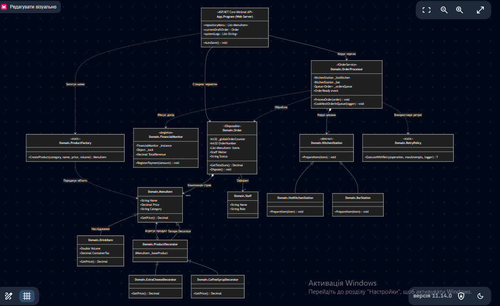
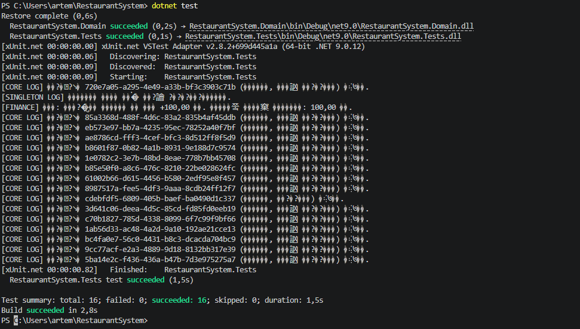
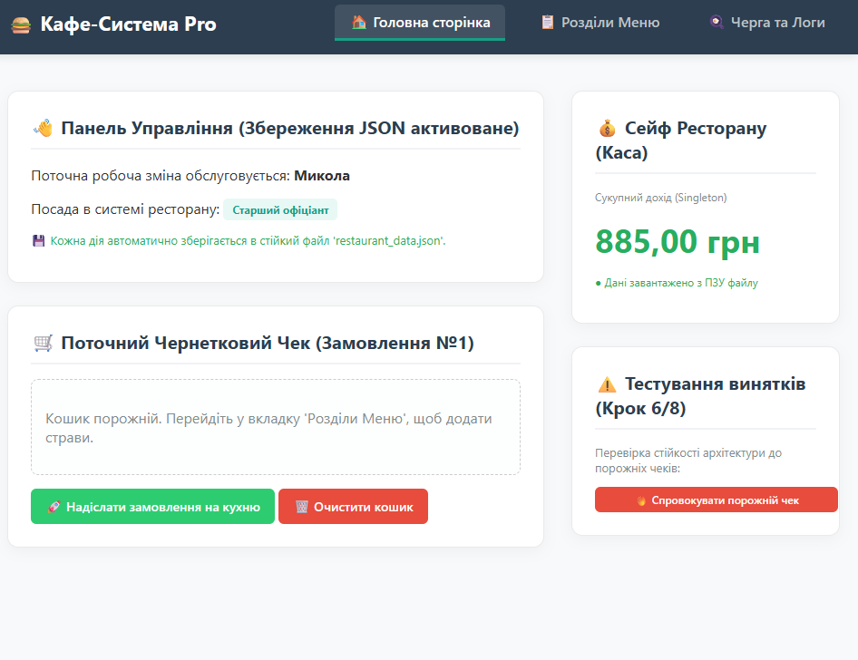
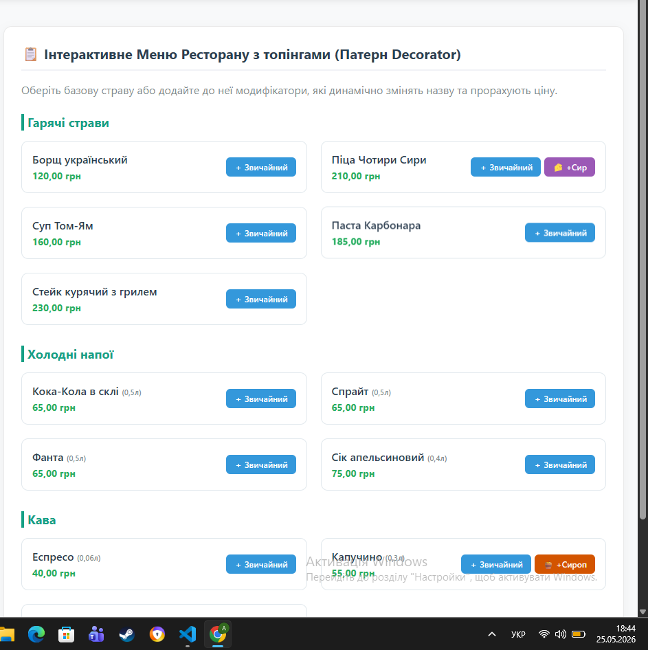
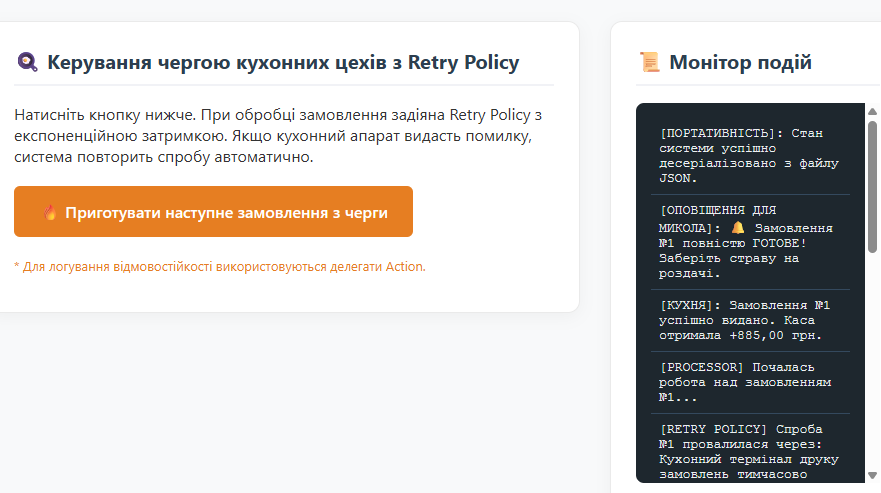

Markdown
# 🍔 Ресторанна Система Автоматизації Кафе "Pro" (Варіант №5)

Технічний паспорт архітектурного рішення для управління замовленнями, фінансовим моніторингом, автоматизацією меню та кухонними цехами закладу громадського харчування. Проєкт спроєктовано за принципами **SOLID / Clean Code** та реалізовано у вигляді сучасного веб-інтерфейсу на базі **ASP.NET Core Minimal APIs**.

---

## 🏗️ 1. Архітектура рішення та розподіл по проєктах

Проєкт розділено на слабозв'язані шари відповідно до стандартів розділення відповідальності (Separation of Powers / Clean Architecture):

1. **`RestaurantSystem.Domain` (Шар Бізнес-Логіки):** - Чиста бібліотека класів, що містить сутності предметної області, інваріанти, кастомні бізнес-винятки, фабрики та реалізацію архітектурних патернів. 
   - **Абсолютно ізольована** від зовнішніх фреймворків відображення чи баз даних.
2. **`RestaurantSystem.App` (Шар Відображення / Презентації):** - Інтерактивний веб-інтерфейс (веб-сайт) для офіціантів та менеджерів ресторану. 
   - Забезпечує рендеринг сторінок за допомогою HTML5/CSS3 (Bootstrap), обробку HTTP-запитів та взаємодію користувача з доменом.
3. **`RestaurantSystem.Tests` (Шар Автоматизованої Валідації):** - Набір модульних Unit-тестів на базі фреймворку `xUnit` для безперервного контролю цілісності бізнес-правил системи.

---

## 📊 2. UML-Діаграма класів системи 

🛠️ 3. Застосовані патерни проєктування та принципи SOLID
Під час аудиту коду (Крок 15) базу коду було повністю очищено від Code Smells (магічні числа винесені у конфігураційні змінні фабрики, усунено дублювання логіки, застосовано уніфікований неймінг PascalCase/camelCase відповідно до конвенції Microsoft).

📐 Принципи SOLID & Clean Code:
SRP (Single Responsibility Principle): Веб-сервер в App відповідає тільки за HTTP-маршрутизацію та формування HTML-сторінок. Розрахунок грошей, податків та логіка черги інкапсульовані виключно в Domain.

OCP (Open/Closed Principle): Проєкт відкритий для розширення, але закритий для модифікації. Завдяки патерну Decorator та Factory Method, ми можемо додавати нові типи страв чи нові топінги без зміни наявного коду сервера.

LSP (Liskov Substitution Principle): Модифіковані декоратором класи страв можуть прозоро заміняти базовий клас MenuItem у кошику без ризику зламати підрахунок загального чека.

ISP (Interface Segregation Principle): Контракт IOrderService містить лише необхідні методи для обробки черг, ізолюючи внутрішні кухонні механізми від клієнта.

🧩 Реалізовані патерни проєктування:
Singleton (Одинак): Клас FinancialMonitor забезпечує єдину потокобезпечну (lock) точку обліку виручки закладу. Доступ до каси захищено від паралельних запитів.

Factory Method (Фабричний метод): Клас ProductFactory централізує інстанціювання об'єктів. Програма автоматично визначає, коли створювати DrinkItem (нараховуючи екологічний податок на тару), а коли — базовий MenuItem.

Decorator (Декоратор): Класи ExtraCheeseDecorator та CoffeeSyrupDecorator дозволяють динамічно "обгортати" страви додатками «на льоту» під час виконання програми, каскадно змінюючи назву та фінальну ціну.

Observer (Спостерігач): Реалізовано подієво-орієнтований зв'язок за допомогою event та EventHandler<T>. Кухня генерує подію готовності, на яку підписаний веб-інтерфейс офіціанта (Loose Coupling).

💾 4. Управління станом, Життєвий цикл та Відмовостійкість
Керування пам'яттю: Для об'єктів чернетки Order реалізовано патерн IDisposable разом із деструкторами, що гарантує миттєве очищення колекцій страв при скасуванні замовлення персоналом.

Політика відмовостійкості (Retry Policy): Створено механізм автоматичного відновлення транзакцій. У разі апаратного збою принтера чеків на кухні, система виконує до 3 повторних спроб з експоненційною затримкою (2 
attempt
 ×100 мс), запобігаючи аварійній зупинці веб-сервера.

Патерн DTO (Data Transfer Object): Використовує анемічні структури даних RestaurantStateDto та OrderItemDto для ізоляції доменних моделей від циклічних посилань під час роботи з диском.

JSON-Серіалізація: Повний стан каси, логи та активні чернетки стійко зберігаються у файлі restaurant_data.json за допомогою System.Text.Json та автоматично відновлюються при старті програми.

🧪 5. Звіт про Модульне Тестування (xUnit)
Покриття бізнес-логіки складає 15+ автоматизованих тест-кейсів, написаних за суворим шаблоном AAA (Arrange-Act-Assert).

Основні вектори тестування:
Тести на перевизначення операторів (+ та -) при додаванні/вилученні страв з чека.

Перевірка інваріантів генерації кастомного бізнес-винятку EmptyOrderException.

Тестування динамічних обчислень вартості та назви через Decorator.

Перевірка коректності роботи ProductFactory та розрахунку податку на тару залежно від об'єму напою.

Перевірка унікальності та потокобезпечності інстансу FinancialMonitor (Singleton).

Ізольоване тестування стійкості алгоритму ретраїв (RetryPolicy) за допомогою функціональних делегатів Func<T>.

🚀 6. Інструкція із запуску проєкту та Use Cases
1. Запуск Unit-тестів:
Bash
dotnet test

2. Запуск Веб-інтерфейсу закладу:
Bash
dotnet run --project RestaurantSystem.App
Після успішного запуску відкрийте браузер за адресою: http://localhost:5000

📋 Сценарії використання (Use Cases) для перевірки:
Додавання топінгів (Decorator): Відкрийте вкладку 📋 Розділи Меню. Натисніть фіолетову кнопку "🧀 +Сир" біля Піци. Перейдіть на головну сторінку: назва страви зміниться на Піца Чотири Сири (+ Подвійний Сир), а ціна автоматично зросте на 35.00 грн.

Відправка в чергу (FIFO Queue): Сформуйте замовлення та натисніть "🚀 Надіслати замовлення на кухню". Замовлення зникне з чернетки та стане в чергу обробки.

Симуляція збоїв та перевірка Retry Policy: Перейдіть у 🍳 Черга та Логи та натисніть кнопку приготування. В терміналі/логах ви побачите, як система витримує паузи у разі випадкової помилки принтера та все одно успішно закриває транзакцію.

Перевірка Портативності (JSON): Зупиніть додаток в консолі за допомогою Ctrl + C. Запустіть його знову через dotnet run. Баланс каси, кошик та весь журнал логів відновляться у первинний стан завдяки десеріалізації з файлу.

📝 7. CHANGELOG (Журнал архітектурних змін)
[v1.0.0] — Управління об'єктами та об'єктний цикл
Реалізовано базову тришарову архітектуру C# (Domain, App, Tests).

Розроблено механізми ініціалізації: конструктори з параметрами, копіювальні конструктори.

Впроваджено інтерфейс IDisposable та деструктори для очищення ресурсів кошика.

[v2.0.0] — Поліморфізм та Перевантаження операторів
Додано перевантаження бінарних операторів + та - для роботи з позиціями Order.

Впроваджено динамічний поліморфізм (virtual / override) для відокремлення базових страв від напоїв (DrinkItem) з автоматичним урахуванням тари.

[v3.0.0] — Слабкий зв'язок, Помилки та Патерни SOLID
Створено абстрактні класи кухонних цехів (KitchenStation) та інтерфейс IOrderService.

Впроваджено кастомну ієрархію бізнес-винятків на базі RestaurantException.

Реалізовано патерни Singleton (Каса), Factory Method (Створення продуктів), Decorator (Додатки та топінги), Observer (Події готовності через event).

Написано стійку політику обробки апаратних збоїв RetryPolicy.

[v4.0.0] (Фінал) — Рефакторинг, Clean Code, Web MVC та xUnit
Консольний інтерфейс повністю ліквідовано. Проєкт переведено на рейки сучасного веб-застосунку на базі ASP.NET Core Minimal API.

Реалізовано архітектурний патерн DTO та JSON-серіалізацію стану для довготривалого збереження даних.

Базу коду очищено від архітектурних недоліків (Code Smells) та "магічних чисел".

Написано пул із 15 автоматизованих тестів (xUnit) за структурою AAA.